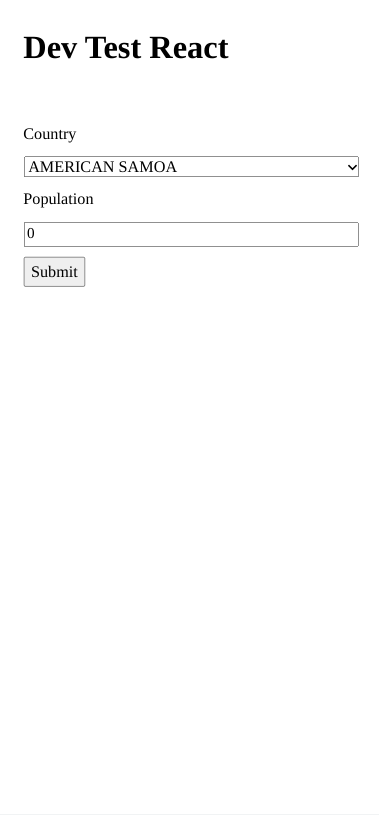
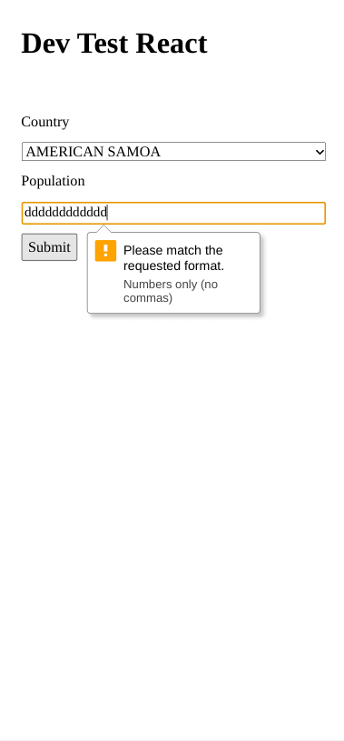
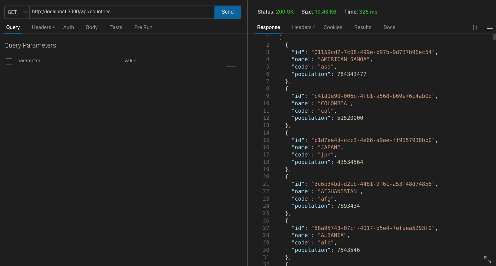
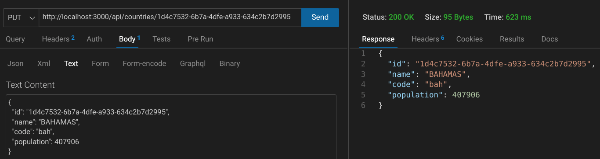
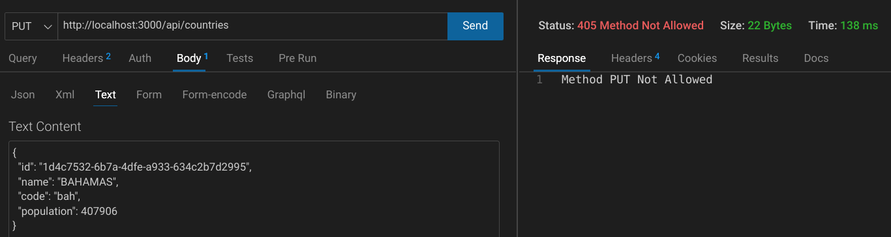
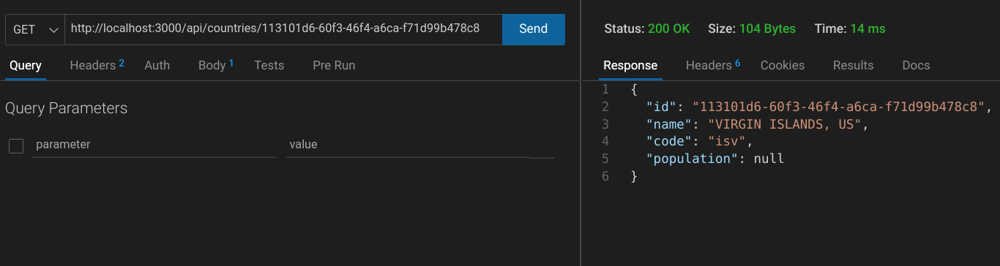
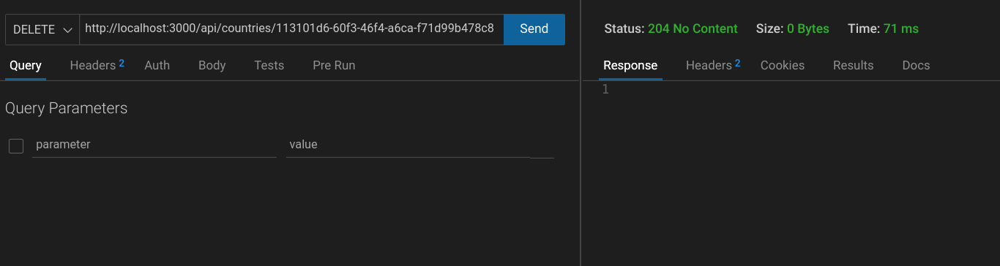
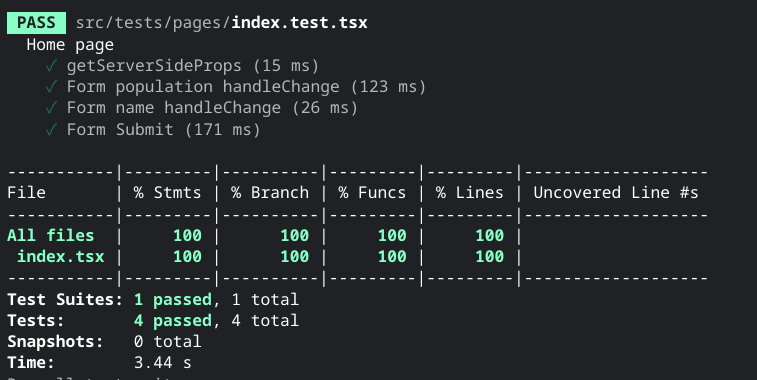

# React Developer Test

This is my solution to this [repo](https://github.com/mizmoz/dev-test-react).

## The Task

Create a page that allows the user to select a country from a list and enter their population. 
This task should take 2-3 hours but don't worry if you aren't able to complete all items, just 
make sure to show your understanding of the core technologies we use.

1. Fork this repo
2. Get the list of available countries from the country API in `src/api/country.js`
3. Create a form which allows the user to select a country from a dropdown and enter their population
4. Sort the countries by population
5. Allow entries to be updated
6. Allow entries to be deleted
7. Add some styling
8. When you're done commit your code and create a pull request

A basic project outline has been created to help you get started quickly but feel free to start 
from scratch if you have a prefered setup.

We predominantly use React, Redux, StyledComponents, Node.js, Webpack, Babel

Feel free to use the internet including Google and Stackoverflow to help with the task

## Built with

- Next JS
- Typescript
- Jest
- React Testing Library

## Screenshots 

***



***



***



***



***



***



***



***



***

## Thoughts

``` javascript
function loop(obj){
  for (const prop in obj) {
    obj.id = self.crypto.randomUUID();
    return obj
  }
}
```

- Used "loop" function to add ids to the json provided
- Also mapped over the data array to add a population property
- The form data is stringified and then passed to the backend.  
- If you want to send json, it won't work because of the JSON.parse call on req.body. (Unexpected token o in JSON at position 1 error)
- You can delete country entries but not on the frontend.  Have you use postman, thunder client etc.
- Sorted countries by descending population.  
- If you change a country to have a higher population, it is not immediately reflected in the select box.  Need to refresh.
- Used 200/204 status codes for PUT / DELETE requests 

## Useful Resources

- [Stack Overflow](https://stackoverflow.com/questions/40972143/add-a-unique-id-for-each-entry-in-json-object) - add a unique id for each entry in json object
- [Blog](https://jasonwatmore.com/post/2021/04/20/next-js-10-crud-example-with-react-hook-form) - next js crud example with react hook form
- [Stack Overflow](https://stackoverflow.com/questions/29829205/sort-an-array-so-that-null-values-always-come-last) - sort an array so null values always come last
- [YouTube](https://www.youtube.com/watch?v=k-Hv0ZneqYM) - Create REST APIs using Next.JS | Dynamic API Routes and CRUD operations
- [YouTube](https://www.youtube.com/watch?v=f2EqECiTBL8) - Node.js Full Course for Beginners | Complete All-in-One Tutorial | 7 Hours (Chapter 9)
- [Stack Overflow](https://stackoverflow.com/questions/43819867/sort-an-array-of-numbers-so-that-null-values-come-last) - sort an array of numbers so that null values come last
- [Bobby Hadz](https://bobbyhadz.com/blog/javascript-sort-array-with-null-last) - sort array with null last
- [Stack Overflow](https://stackoverflow.com/questions/41710536/dynamically-truncate-option-text-to-fit-select-list) - truncate option text
- [React Docs](https://beta.reactjs.org/reference/react-dom/components/select) - select
- [YouTube](https://www.youtube.com/watch?v=mJn0B7mXmDI) - Next.js unit tests with Jest and Testing Library typescript
- [Github](https://github.com/vercel/next.js/tree/canary/examples/with-jest) - next with jest example
- [Blog](https://frontend-digest.com/testing-getserversideprops-in-nextjs-b339ebcf3401) - testing getServerSideProps